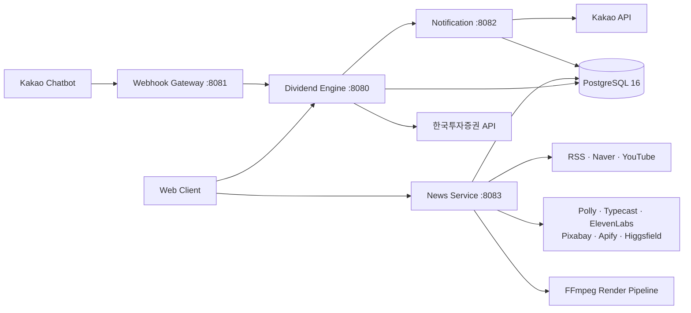
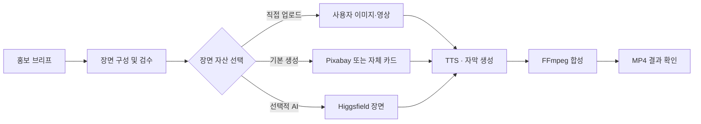

<div align="center">

# MONEY PROJECT

### 홍보지도 × InvestingBoard

투자 포트폴리오와 배당 정보를 관리하고, 뉴스 커뮤니티부터 홍보 전략과 AI 숏폼 제작까지 연결하는 Spring Boot 기반 백엔드입니다.

[](https://openjdk.org/projects/jdk/17/)
[](https://spring.io/projects/spring-boot)
[](https://www.postgresql.org/)
[](https://docs.docker.com/compose/)
[](https://aws.amazon.com/)
[](https://github.com/xogh3198/MONEY_PROJECT/actions/workflows/ci.yml)

</div>

---

## 프로젝트 소개

MONEY PROJECT는 두 가지 제품 경험을 하나의 백엔드 플랫폼으로 제공합니다.

| 영역 | 제공 기능 |
| --- | --- |
| InvestingBoard | 포트폴리오 관리, 월별 배당 계산, 배당락 일정, 투자 뉴스, 포럼·투표·댓글, 시장 지표 |
| 홍보지도 | 홍보 대상 분석, 채널 추천, 예산별 실행 계획, 성과 이벤트 분석, 검수형 콘텐츠 제작 |

서비스는 역할에 따라 4개 애플리케이션으로 분리되어 있지만 PostgreSQL과 Docker Compose를 통해 한 번에 실행할 수 있습니다.

## 핵심 기능

### 투자와 배당 관리

- 이메일 및 소셜 로그인과 JWT 인증
- 보유 종목·수량·매입가 기반 포트폴리오 관리
- 월별 예상 배당금 및 다가오는 배당락 일정 조회
- 일반 계좌와 ISA를 고려한 세율 설정
- 배당 일정 알림 수신 설정
- 한국투자증권 OpenAPI 연동을 위한 데이터 수집 구조

### 뉴스와 투자 커뮤니티

- RSS 및 네이버 검색 기반 투자 뉴스 수집·검색
- 인기 뉴스, 외부 반응 지표, 트렌드 점수 집계
- 게시글·댓글·추천/비추천 기능
- 시장 지표와 시계열 이력 조회
- 수집기 상태 및 성장 지표 운영 화면 지원

### 홍보 실행지도

- URL, 소개글, 상품, 매장, 앱, 콘텐츠 입력을 홍보 브리프로 정규화
- 목표, 고객, 지역, 예산을 기준으로 홍보 채널과 실행 계획 추천
- 채널별 예상 비용과 바로 실행할 수 있는 행동 제시
- SSRF 방지를 포함한 공개 URL 검증

### 검수형 AI 콘텐츠 제작

- 승인된 장면 구성으로 비동기 숏폼 영상 렌더링
- 이미지·영상 업로드, TTS, 자막, FFmpeg 합성
- Amazon Polly, Typecast, ElevenLabs 음성 공급자 선택
- Pixabay 이미지와 자체 카드 기반 무료 폴백
- 동의한 YouTube URL의 편집 구조 분석
- 선택한 장면만 Higgsfield로 생성하는 비용 통제형 AI 워크플로

## 서비스 구성

| 서비스 | 포트 | 역할 | 주요 경로 |
| --- | ---: | --- | --- |
| dividend-engine | 8080 | 인증, 포트폴리오, 배당 계산, 알림 설정 | `/api/auth`, `/api/portfolios`, `/api/dividends` |
| webhook-gateway | 8081 | 카카오 챗봇 스킬 요청과 의도 라우팅 | `/api/kakao/skill` |
| notification | 8082 | 카카오 알림톡 발송과 발송 이력 관리 | `/api/notifications/send` |
| news-service | 8083 | 뉴스·포럼·홍보 분석·AI 영상·성장 분석 | `/api/news`, `/api/forum`, `/api/v1`, `/api/content-videos` |

홍보와 콘텐츠 제작 기능은 별도 JVM을 추가하지 않고 news-service에 통합해 운영 자원을 절약합니다.

## 아키텍처



## 콘텐츠 제작 흐름



외부 AI 공급자를 사용하지 않아도 사용자 자산 → Pixabay → 자체 카드 순서의 폴백을 통해 기본 영상 제작이 가능합니다.

## 기술 스택

| 구분 | 기술 |
| --- | --- |
| Language | Java 17 |
| Framework | Spring Boot 3.3.5, Spring Web, WebFlux, Validation |
| Data | Spring Data JPA, PostgreSQL 16 |
| Security | JWT, Kakao OAuth, Naver OAuth |
| Content | FFmpeg, Amazon Polly, Typecast, ElevenLabs, Pixabay, Apify, Higgsfield |
| External Data | 한국투자증권 OpenAPI, Naver API, RSS, YouTube API |
| Infrastructure | Docker, Docker Compose, GitHub Actions, AWS EC2 |
| API Docs | Springdoc OpenAPI / Swagger UI |

## 빠른 시작

### 1. 준비 사항

- Docker Engine
- Docker Compose v2
- 외부 연동을 사용할 경우 해당 공급자의 API 키

### 2. 저장소 실행

```bash
git clone https://github.com/xogh3198/MONEY_PROJECT.git
cd MONEY_PROJECT
docker compose up -d --build
```

기본 로컬 값만으로 PostgreSQL과 네 개의 서비스가 실행됩니다. 외부 API 키가 없어도 핵심 애플리케이션과 자체 카드 기반 영상 폴백은 사용할 수 있습니다.

### 3. 실행 상태 확인

```bash
curl http://localhost:8080/actuator/health
curl http://localhost:8081/actuator/health
curl http://localhost:8082/actuator/health
curl http://localhost:8083/actuator/health
```

| 항목 | 주소 |
| --- | --- |
| Dividend Engine Swagger | http://localhost:8080/swagger-ui.html |
| News Service Swagger | http://localhost:8083/swagger-ui.html |
| PostgreSQL | `localhost:5432` |

### 4. 종료

```bash
docker compose down
```

데이터 볼륨까지 제거하려면 `docker compose down -v`를 사용합니다. 이 명령은 로컬 DB와 렌더 결과를 삭제하므로 주의해야 합니다.

## 환경 변수

로컬 개발에서는 필요한 값만 `.env`에 추가하면 Docker Compose가 자동으로 읽습니다. 실제 비밀값은 저장소에 커밋하지 않습니다.

### 공통·투자 기능

| 변수 | 설명 | 필수 여부 |
| --- | --- | --- |
| `DB_PASSWORD` | PostgreSQL 비밀번호 | 운영 필수 |
| `JWT_SECRET` | JWT 서명 키, 32자 이상 권장 | 운영 필수 |
| `KIS_APP_KEY` | 한국투자증권 앱 키 | 선택 |
| `KIS_APP_SECRET` | 한국투자증권 앱 시크릿 | 선택 |
| `KAKAO_CLIENT_ID` | 카카오 OAuth 클라이언트 ID | 소셜 로그인 사용 시 |
| `KAKAO_SENDER_KEY` | 카카오 알림톡 발신 프로필 키 | 알림톡 사용 시 |

### 뉴스·콘텐츠 기능

| 변수 | 설명 | 기본값 |
| --- | --- | --- |
| `NAVER_CLIENT_ID` | 네이버 검색 API 클라이언트 ID | 미설정 |
| `NAVER_CLIENT_SECRET` | 네이버 검색 API 시크릿 | 미설정 |
| `YOUTUBE_API_KEY` | YouTube 데이터 조회 키 | 미설정 |
| `VIDEO_RENDER_ENABLED` | 서버 영상 렌더 활성화 | `false` |
| `VIDEO_RENDER_ACCESS_KEY` | 영상 API 접근 키 | 미설정 |
| `VIDEO_VOICE_PROVIDER` | 음성 공급자 선택 | `POLLY` |
| `PIXABAY_API_KEY` | 장면용 공개 이미지 검색 키 | 미설정 |
| `APIFY_REFERENCE_ENABLED` | 참조 영상 구조 분석 활성화 | `false` |
| `APIFY_API_TOKEN` | Apify API 토큰 | 미설정 |
| `HIGGSFIELD_ENABLED` | AI 장면 생성 활성화 | `false` |
| `HIGGSFIELD_API_KEY` | Higgsfield API 키 | 미설정 |
| `HIGGSFIELD_API_SECRET` | Higgsfield API 시크릿 | 미설정 |

Typecast와 ElevenLabs를 사용할 때는 각 공급자의 API 키와 Voice ID를 함께 설정합니다. Apify와 Higgsfield는 기본적으로 비활성화되며, 설정한 경우에만 외부 요청과 비용이 발생합니다.

## 주요 API

### Dividend Engine

| 메서드 | 경로 | 설명 |
| --- | --- | --- |
| POST | `/api/auth/register` | 이메일 회원가입 |
| POST | `/api/auth/login` | 로그인 및 JWT 발급 |
| POST | `/api/auth/kakao` | 카카오 로그인 |
| POST | `/api/auth/naver` | 네이버 로그인 |
| GET/POST | `/api/portfolios` | 포트폴리오 조회·등록 |
| PUT/DELETE | `/api/portfolios/{id}` | 포트폴리오 수정·삭제 |
| GET | `/api/dividends/monthly` | 월별 배당 요약 조회 |
| GET | `/api/dividends/ex-dates` | 배당락 일정 조회 |

### News & Community

| 메서드 | 경로 | 설명 |
| --- | --- | --- |
| GET | `/api/news` | 뉴스 목록 조회 |
| GET | `/api/news/search` | 뉴스 검색 |
| GET | `/api/news/hot` | 인기 뉴스 조회 |
| GET/POST | `/api/forum/posts` | 게시글 조회·작성 |
| GET/POST | `/api/forum/posts/{postId}/comments` | 댓글 조회·작성 |
| POST | `/api/forum/posts/{postId}/vote` | 게시글 투표 |
| GET | `/api/market/indicators` | 시장 지표 조회 |

### Promotion & Video

| 메서드 | 경로 | 설명 |
| --- | --- | --- |
| POST | `/api/v1/promotion-sources` | 홍보 대상을 분석 가능한 브리프로 정규화 |
| GET | `/api/v1/promotion-sources/{analysisId}` | 분석 결과 조회 |
| GET | `/api/v1/channels` | 지원 홍보 채널 조회 |
| POST | `/api/v1/promotion-plans` | 예산과 목표에 맞춘 실행 계획 생성 |
| POST | `/api/content-videos/assets` | 장면용 이미지·영상 업로드 |
| POST | `/api/content-videos/render` | 비동기 MP4 렌더 작업 생성 |
| GET | `/api/content-videos/{jobId}` | 렌더 상태 조회 |
| POST | `/api/content-videos/reference-analysis` | 동의한 참조 영상의 편집 구조 분석 |
| POST | `/api/content-videos/ai-assets` | 선택 장면의 AI 자산 생성 |

영상 관련 API는 `X-Video-Render-Key` 헤더로 접근을 제한합니다. 전체 계약은 실행 중인 Swagger 문서를 기준으로 확인합니다.

## 데이터베이스

모든 데이터 서비스는 하나의 PostgreSQL 인스턴스를 공유합니다.

- JPA가 애플리케이션 기본 테이블을 관리합니다.
- `infra/db`의 SQL 파일이 포트폴리오, 알림 설정, 포럼, 뉴스 지표, 수집 상태, 영상 작업, 성장 이벤트 스키마를 순서대로 확장합니다.
- 운영 배포 워크플로는 서비스 시작 전후에 필요한 SQL을 적용하고 실패 시 즉시 중단합니다.
- EC2 내부에는 7일 보관 일일 백업을 생성합니다. 인스턴스 손실에 대비한 오프사이트 백업은 별도 구성이 필요합니다.

## 테스트

각 서비스는 독립적인 Gradle 프로젝트입니다.

```bash
cd services && gradle test
cd services/news-service && gradle test
cd services/notification && gradle test
cd services/webhook-gateway && gradle test
```

Pull Request가 main을 대상으로 생성되면 GitHub Actions가 네 서비스를 각각 빌드합니다.

## 배포

운영 배포는 자동 푸시 배포가 아니라 수동 승인 방식입니다.

1. 변경 사항을 main에 반영합니다.
2. GitHub Actions에서 `Deploy to EC2` 워크플로를 실행합니다.
3. 워크플로가 이미지를 빌드하고 PostgreSQL 마이그레이션을 적용합니다.
4. 네 서비스의 Actuator 상태가 모두 `UP`인지 확인한 뒤 배포를 완료합니다.

배포에는 `EC2_HOST`, `EC2_USER`, `EC2_SSH_KEY` GitHub Actions Secret이 필요합니다. 런타임 비밀값은 로그에 출력하지 않고 EC2의 권한 제한 파일로 전달됩니다.

## 디렉터리 구조

```text
MONEY_PROJECT/
├── services/
│   ├── src/                    # Dividend Engine
│   ├── news-service/           # News, Forum, Promotion, Video
│   ├── notification/           # Kakao Alimtalk
│   └── webhook-gateway/        # Kakao Skill Gateway
├── infra/db/                   # PostgreSQL migrations
├── config/tax_rates.yaml       # 배당·계좌 세율 설정
├── docker-compose.yml          # Local integrated environment
└── .github/workflows/          # CI, deploy and stop workflows
```

## 관련 저장소

- [MONEY_PROJECT_FRONT](https://github.com/xogh3198/MONEY_PROJECT_FRONT) — InvestingBoard와 홍보지도 프론트엔드

---

<div align="center">
  투자 정보를 이해하는 것에서 끝나지 않고, 실행 가능한 콘텐츠와 성장 전략까지 연결합니다.
</div>
